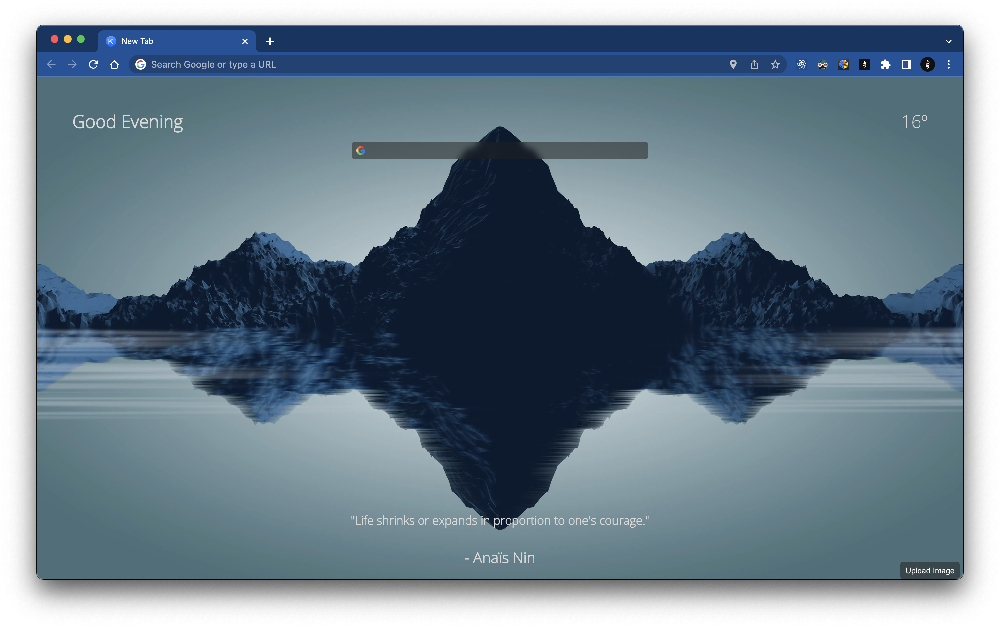

# What is this?

This is a new tab extension that aims to inspire and focus people, it comes with a simple weather and quote API integration, and it uses random wallpapers from NASA.

## Wallpapers

NASA has an API that returns images randomly, but my code lacks optimization, so if NASA selects a very high resolution image, it can take a while to load in, but most web browsers cache it in. They are also not guaranteed to be good images or even fit on your screen correctly, like 4k square images appearing pixelated. If someone wants to, they can help me optimize it.

## Screenshots

## Available Scripts

In the project directory, you can run:

### `npm start`

Runs the app in the development mode.\
Open [http://localhost:3000](http://localhost:3000) to view it in your browser.

The page will reload when you make changes.\
You may also see any lint errors in the console.

### `npm test`

Launches the test runner in the interactive watch mode.\
See the section about [running tests](https://facebook.github.io/create-react-app/docs/running-tests) for more information.

### `npm run build`

Builds the app for production to the `build` folder.\
It correctly bundles React in production mode and optimizes the build for the best performance.

The build is minified and the filenames include the hashes.\
Your app is ready to be deployed!

See the section about [deployment](https://facebook.github.io/create-react-app/docs/deployment) for more information.

### `npm run eject`

**Note: this is a one-way operation. Once you `eject`, you can't go back!**

If you aren't satisfied with the build tool and configuration choices, you can `eject` at any time. This command will remove the single build dependency from your project.

Instead, it will copy all the configuration files and the transitive dependencies (webpack, Babel, ESLint, etc) right into your project so you have full control over them. All of the commands except `eject` will still work, but they will point to the copied scripts so you can tweak them. At this point you're on your own.

You don't have to ever use `eject`. The curated feature set is suitable for small and middle deployments, and you shouldn't feel obligated to use this feature. However we understand that this tool wouldn't be useful if you couldn't customize it when you are ready for it.

## Using the extension

In most of the chromium based web browsers, go to `chrome://extensions` and enable Developer Mode, and then you load unpacked and then you navigate to the [manifest.json](https://bitbucket.org/KynuxGamesInc/kalele/src/master/manifest.json) and it should work! In the future there will be a chrome web store page.

## Setting API keys

You need to make a apikeys.json file in the src directory, and it should look something like this:
`{
	"weather": "your key here",
	"wallpapers": "your key here"
}
`
You can get your keys from [open weather map](https://openweathermap.org/api) and [nasa](https://api.nasa.gov/). Obviously my keys are not included in the source code, since they must remain secret.
